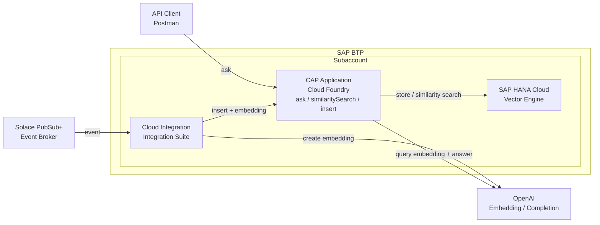

# CAP Business Partner RAG — BTP Architecture (logical)

## Flows

**Ingestion（取込）**
1. `Solace → Cloud Integration` : Business Partner イベント受信
2. `Cloud Integration → OpenAI` : テキストを embedding 化
3. `Cloud Integration → CAP` : embedding 付きで insert API 呼び出し
4. `CAP → HANA Cloud` : Vector(1536) を格納

**Query（質問回答）**
5. `API Client (Postman) → CAP` : ask API 呼び出し
6. `CAP → OpenAI` : クエリの embedding 化 + 回答生成（gpt-4o-mini）
7. `CAP → HANA Cloud` : cosine_similarity による類似検索

## Notes
- 非SAP（BTP外）: Solace PubSub+, OpenAI, API Client (Postman)
- SAP（BTP内）: Cloud Integration, CAP, HANA Cloud
- OpenAI は Cloud Integration（取込時 embedding）と CAP（クエリ embedding + 回答生成）の両方から呼ばれる
- 質問者の入口・イベント発生源（テスト）は本図では省略
