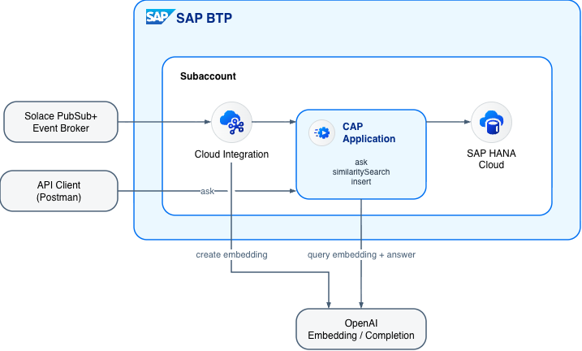

# cap-bp-rag

This repository is my submission for the [**May 2026 Developer Challenge — From Events to Intelligence: Building an Event-Driven RAG Application**](https://community.sap.com/t5/integration-blog-posts/may-2026-developer-challenge-from-events-to-intelligence-building-an-event/ba-p/14386772).

It implements an event-driven Retrieval-Augmented Generation (RAG) application built with the SAP Cloud Application Programming Model (CAP), using SAP HANA Cloud's Vector Engine as the vector store and OpenAI for embeddings and answer generation.

## Architecture

**Inside SAP BTP:** Cloud Integration (Integration Suite), the CAP application (Cloud Foundry), and SAP HANA Cloud Vector Engine.
**Outside BTP:** Solace PubSub+ (event broker), OpenAI (embedding / completion), and an API client (Postman).

### Ingestion flow

1. **Solace PubSub+ → Cloud Integration** — receive a Business Partner event.
2. **Cloud Integration → OpenAI** — create an embedding for the text.
3. **Cloud Integration → CAP** — call the `insert` API with the embedding.
4. **CAP → SAP HANA Cloud** — store the vector (1536 dimensions).

### Query flow

5. **API Client (Postman) → CAP** — call the `ask` API.
6. **CAP → OpenAI** — embed the query and generate the answer (`gpt-4o-mini`).
7. **CAP → SAP HANA Cloud** — run a similarity search via `cosine_similarity`.

The result is an intelligent, event-driven application that turns raw business events into actionable, queryable insights.
